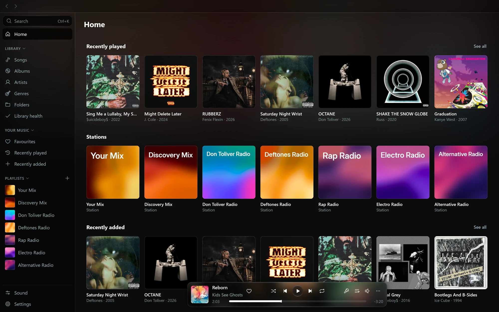

<div align="center">

# Octo

**Play your music server from your computer and your phone, and add the songs you don't have yet.**

A music player for Navidrome and other Subsonic servers, on Windows, Linux and Android.
With an [Octo server](https://github.com/winters27/octo) behind it, search reaches past your library, and a song you find joins your library with one press.

[](https://www.gnu.org/licenses/gpl-3.0)

</div>



| | |
| --- | --- |
|  |  |


## What both apps do

- Browse your library by artist, album, song, genre or the server's folders. Favourites, star ratings and the server's playlists are the same ones your other apps see.
- Home has your recently played, recently added and most played albums and your favourites.
- Lyrics that follow the song, word by word when the lyrics carry that timing. They come from your server, from the song file, or, with **Find lyrics online** on, from LRCLIB. You can pick other lyrics for a song, hide them, or shift their timing.
- Gapless playback, an equalizer (ten bands or your own filters, with presets), loudness matching from ReplayGain tags, balance and mono, a limiter, playback speed with or without a pitch change, and headphone correction imported from a `ParametricEQ.txt` file. Each output, such as your speakers or a pair of headphones, can keep its own sound.
- A queue with undo, **Save as playlist**, **Stop after this song** and a sleep timer that can end on a time, at the end of a song or after a few songs. When the queue runs out, **Autoplay** carries on with similar songs.
- Radio from any song or album.
- The queue travels through your server, so you can pick up on the phone where the desktop left off, and the other way round.
- Plays are reported to your server, so its play counts and scrobbling stay current.
- Playlists export to and import from M3U files.
- Sign in with a password or an API key, add a home network address that is used whenever it answers, send custom headers to a proxy in front of your server, and trust a self-signed certificate after checking its fingerprint.

## With an Octo server

[Octo](https://github.com/winters27/octo) sits in front of Navidrome and finds music you don't own. The apps read its extensions, so that music shows up next to yours.

- Search shows your own artists, albums and songs first, then under **Not in your library** the songs, albums and artists Octo found. They play straight away.
- Press **+** on a song you don't have, in search, in a list or on the player, and Octo downloads it into your library. The button fills as the download runs and becomes a check once the song is yours. On Android the notification has an **Add to your library** button for the song playing.
- On the desktop app, an album you own part of lists every track: a check on the songs you have and a **+** on the rest. The line under the title says how many you have ("7 of 12 in your library"), and **Add the 5 missing songs** fetches the rest.
- Octo's stations are on Home, with their covers, and its mixes are with your playlists. Octo draws their covers in the same painted style the desktop app gives your playlists.
- Radio from a song or album mixes in music from outside your library.
- A song you don't own is marked wherever it appears and stays out of your library lists. It can be hearted and rated once it's yours.
- When Octo's lyrics lookups are on, a lyrics choice you make (other lyrics, or none) holds in every app on the server.
- The Android app has an **Octo admin** page for your home network: whether each of Octo's services is working, your stations with a button to refresh them, and the latest downloads.

These need Octo 2026.09.29 or newer.

## With Navidrome or another Subsonic server

Everything under [What both apps do](#what-both-apps-do) works the same. What changes without Octo:

- Search finds only what's in your library, and nothing has a **+**.
- An album shows the songs you have.
- Radio and **Autoplay** use the similar songs the server offers, all from your library. When it offers none, **Autoplay** stays with the same artist or genre.
- Lyrics choices are kept on the device where you make them.
- Octo's stations, mixes and admin page are the only other things missing.

## The desktop app

For Windows and Linux.

- Keep several servers and switch between them in one click. Each keeps its own queue, plays and live lists.
- A song table with the columns you choose: sort by any of them, drag their widths, pick several songs with the mouse or the keyboard.
- **Ctrl+K** searches from anywhere; type `>` for commands such as going to a page, sleep timers or switching servers.
- Filters on song lists, and live lists: playlists built from rules (added lately, never played, a genre, a rating) that stay up to date. Live lists are kept on the computer, and **Save a copy as a playlist** puts one on your server.
- **Library health** finds songs you have twice, albums split in two, and songs missing a track number, album artist, cover, year or genre.
- Playlists get a painted cover with their name on it, in colours taken from their music. **Playlist covers** in Settings switches to a mosaic of album covers instead.
- Home also has "Not played in 6 months", "Albums you never finished" and "Unplayed albums".
- A queue panel split into what played, what you added and what comes next from the album. Drag songs from any list onto the queue, the player or a playlist.
- Crossfade of up to 12 seconds, with albums played in order kept gapless.
- Pick the output device under **Play on**.
- A mini player window, with lyrics or the queue inside if you want them.
- Media keys and the system's media controls, and a tray icon.
- On Windows: play buttons in the taskbar thumbnail, a jump list of pinned albums and recent plays, optional global shortcuts, and starting with Windows.
- Drop audio files on the window, or open them with Octo, to play them.
- Change your password and see how quickly each server answers, what it runs and when it last scanned, from **Settings > Servers**.

## The Android app

For Android 10 or newer.

- The music on your phone and the music on your server make one library. A song on both shows once, and you choose whether the phone's copy or the best quality one plays.
- Download songs, albums and playlists to play offline, and keep your liked songs downloaded. A cache keeps songs you played lately, and can fetch the next few in the queue ahead of time.
- Choose streaming quality separately for Wi-Fi and mobile data: the original file, or MP3 from 128 to 320 kbps made by the server.
- Controls in the notification and on the lock screen, and home screen widgets for what's playing and for quick picks.
- Resumes when headphones or Bluetooth reconnect, if you want it to.
- Save your settings, playlists, likes and favourites to a backup file, and restore them later.
- Playlists you make on the phone stay on it until you choose **Save to server**, or turn on **Save new playlists to the server**.
- Share links to songs and albums, manage your server's internet radio stations, and see who else is listening now.
- Set a song on the phone as a ringtone, notification or alarm sound.
- It signs in to one server at a time, and plays the music on the phone with no server at all.

## Install

The first builds are on their way to the [Octo Releases page](https://github.com/winters27/octo/releases), as releases tagged `desktop-v` and `android-v`. The dated releases beside them are the Octo server. Until then, you can build the apps from source.

| System | File |
| --- | --- |
| Windows (x64) | `Octo-<version>-windows-x64.msi`, or `-portable.zip` to run without installing |
| Linux (x64) | `Octo-<version>-linux-x64.deb`, `.rpm`, or `-portable.zip` |
| Android 10+ | `Octo-<version>-android.apk` |

- The Windows installer installs Octo for your user only, so it needs no administrator rights.
- The installers are not code signed yet, so Windows warns the first time you open Octo.
- To install the APK, allow your browser or file manager to install apps when Android asks.

## Build from source

You need JDK 17. The Android app also needs the Android SDK (platform 37). The desktop app plays through its own audio engine, written in Rust, so it needs Rust 1.88 or newer and:

- Windows: the MSVC build tools.
- Linux: `libasound2-dev` and `pkg-config` (Fedora: `alsa-lib-devel`), plus `fakeroot` and `rpm` to build packages.

```bash
git clone https://github.com/winters27/octo-player.git
cd octo-player

# Android: a debug APK, which installs beside a release build
./gradlew :app:assembleDebug

# Desktop: run it
./gradlew :desktop:run

# Desktop installers, each on its own system
./gradlew :desktop:packageMsi :desktop:packagePortableZip                        # Windows
./gradlew :desktop:packageDeb :desktop:packageRpm :desktop:packagePortableZip    # Linux

# Tests
./gradlew :shared:core:allTests :app:testDebugUnitTest :desktop:test
(cd audio-engine && cargo test)
```

- The debug APK lands in `app/build/outputs/apk/debug/`, and desktop installers in `desktop/build/compose/binaries/main/`.
- `./gradlew :app:assembleRelease` signs the APK when `OCTO_ANDROID_KEYSTORE`, `OCTO_ANDROID_KEYSTORE_PASSWORD`, `OCTO_ANDROID_KEY_ALIAS` and `OCTO_ANDROID_KEY_PASSWORD` are set, and leaves it unsigned otherwise.
- `-Pocto.noSystemShim=true` builds the desktop app without its media-controls helper, which is also written in Rust.

| Folder | What's there |
| --- | --- |
| `app/` | the Android app |
| `desktop/` | the desktop app |
| `shared/core/` | what both apps share: lyrics, sound, queue rules, song matching, covers, updates |
| `subsonic/` | the Subsonic and OpenSubsonic client, with Octo's extensions |
| `design/`, `desktop-design/` | colours, type, icons and fonts |
| `audio-engine/` | the desktop audio engine (Rust) |

## License

[GPL-3.0](LICENSE)

## Credits

- [Inter](https://rsms.me/inter/) by Rasmus Andersson, under the SIL Open Font License 1.1 ([licence](design/licenses/Inter-OFL.txt)).
- [Phosphor Icons](https://phosphoricons.com/), under the MIT License ([licence](design/licenses/Phosphor-MIT.txt)).
