<div align="center">

# Octo

**The desktop and Android apps for your Octo music server.**

[](https://www.gnu.org/licenses/gpl-3.0)

<a href="https://winters27.github.io/octo/fdroid/"></a>

</div>

[Octo](https://github.com/winters27/octo) is a proxy that adds discovery to your Navidrome server and works with any Subsonic app. These are players made to go with it: the music Octo finds sits beside your library, and keeping a song is just **Add to library**.


## With Octo

- **Add songs to your library.** Press **+** on a song, an album or a search result, and it joins your library.
- **One search for everything.** Your music comes first, then what Octo found, and all of it plays straight away.
- **Whole albums.** Every track shows, the ones you have are marked, and one press adds the rest.
- **Stations on Home,** each with its own painted cover, and radio that reaches past your library.
- **Honest labels.** A song you don't own is marked as such until you add it.
- **Spotify import.** Connect Spotify, or add a public playlist link, to see what your library has of each list, keep one as a playlist, and let Octo fetch the rest a few songs an hour. On the desktop it is in the sidebar; on the phone, under Settings, Server. Needs an Octo with Spotify import.

These need Octo 2026.09.29 or newer.

## With any Subsonic server

With Navidrome or any Subsonic server, both apps are full players for the music you have:

- Browse by artist, album, song, genre or folder, with favorites, ratings and playlists shared with your other apps.
- Synced lyrics, gapless playback, an equalizer with presets, ReplayGain and a sleep timer.
- A queue that follows you between the desktop and the phone, and plays reported to your server.

## The desktop app

For Windows and Linux. Several servers with one-click switching, a song table you can sort and resize, **Ctrl+K** to search or run a command from anywhere, live lists built from rules, Library health, a mini player, and media keys.

<table>
<tr><td width="50%" valign="top"><br><sub>An album, with the songs you have marked</sub></td><td width="50%" valign="top"><br><sub>The full player</sub></td></tr>
<tr><td width="50%" valign="top">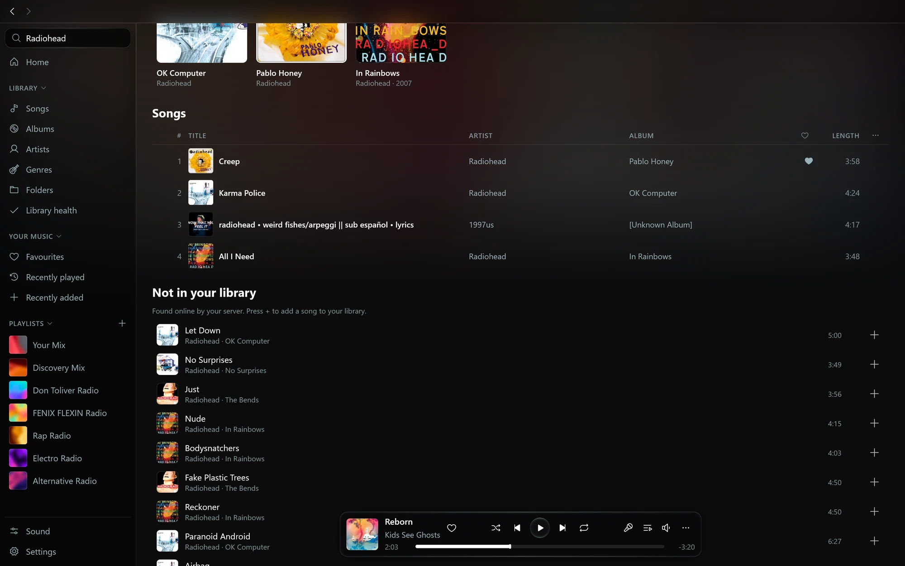<br><sub>Search: your music, then what Octo found</sub></td><td width="50%" valign="top">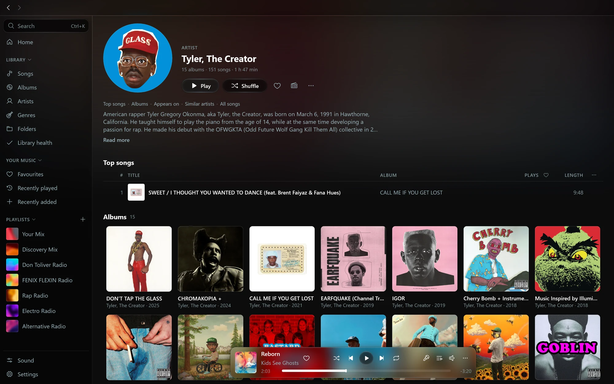<br><sub>An artist</sub></td></tr>
<tr><td width="50%" valign="top">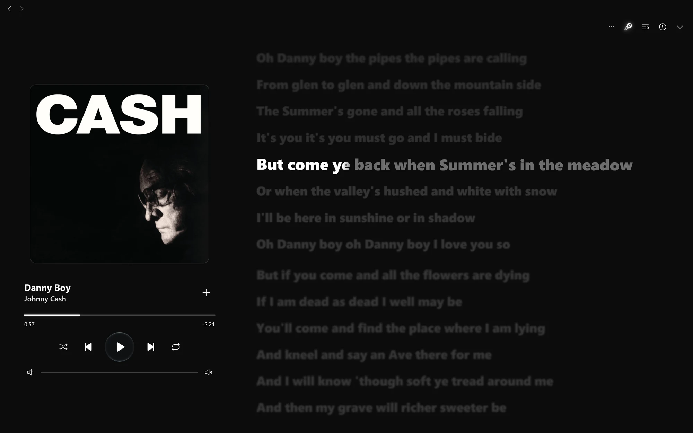<br><sub>Live lyrics, word by word</sub></td><td width="50%" valign="top">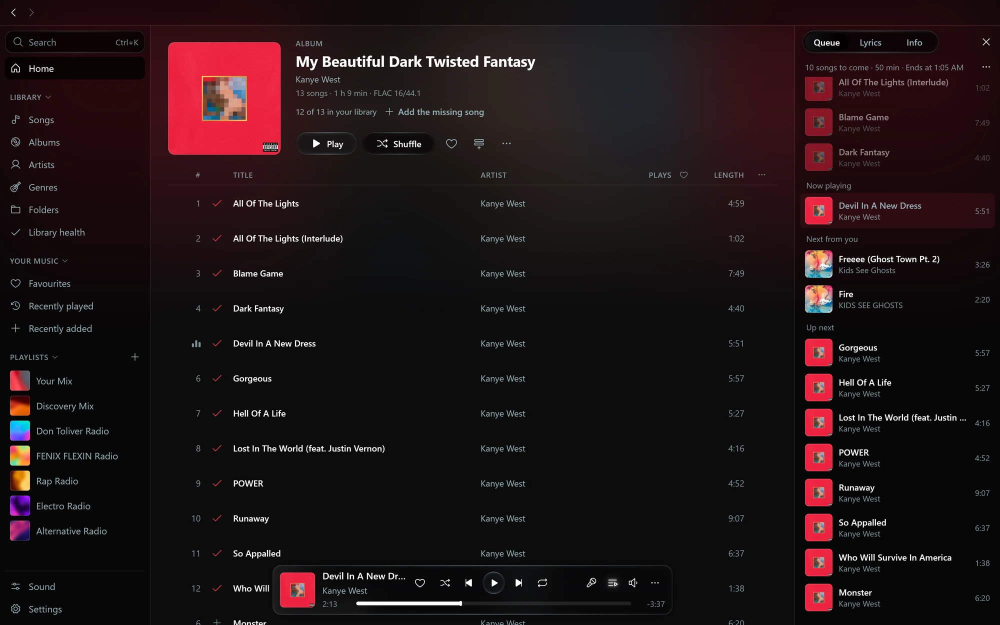<br><sub>The queue beside an album</sub></td></tr>
<tr><td width="50%" valign="top">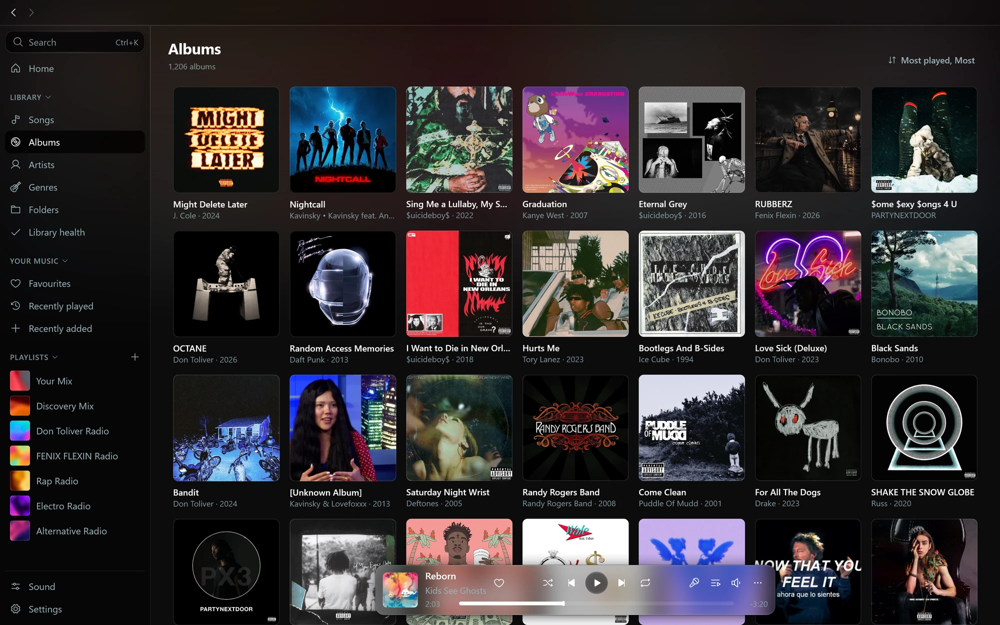<br><sub>Albums</sub></td><td width="50%" valign="top">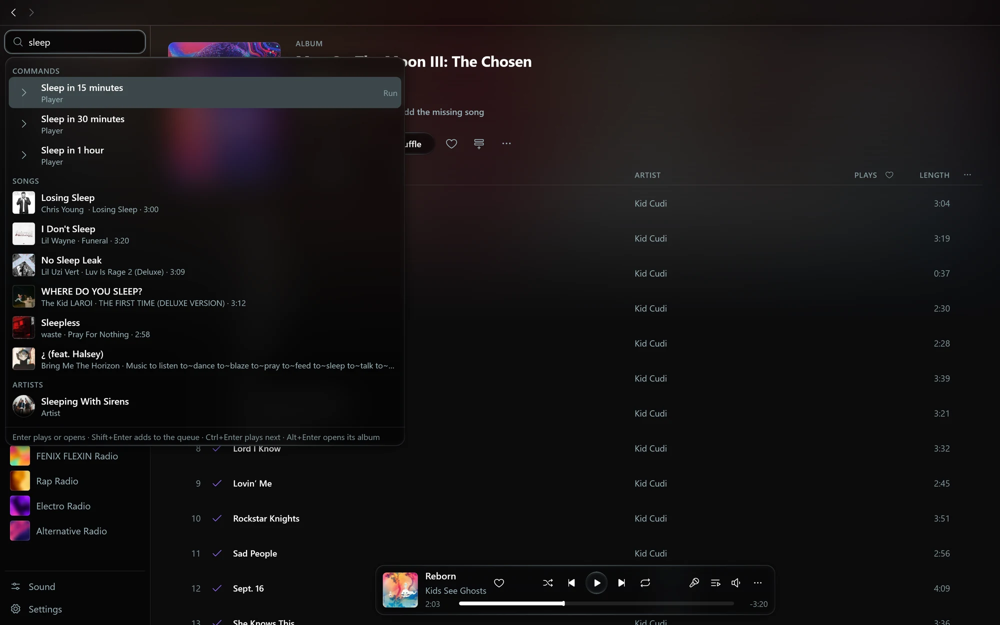<br><sub>Ctrl+K from anywhere</sub></td></tr>
<tr><td width="50%" valign="top">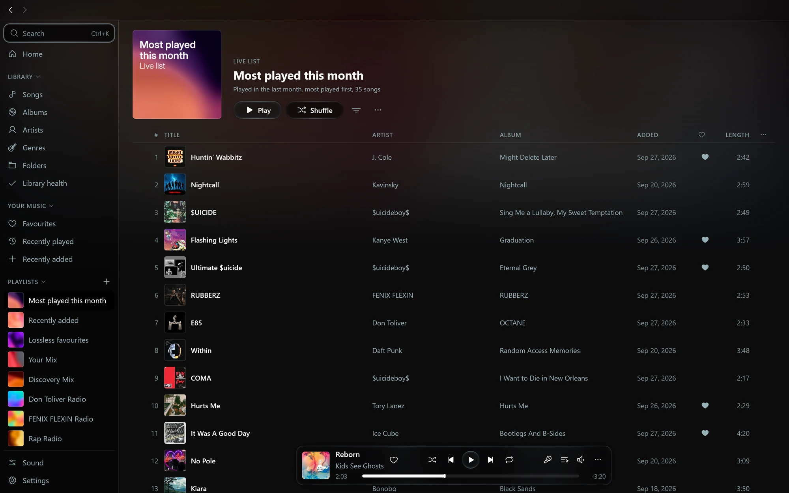<br><sub>A live list</sub></td><td width="50%" valign="top">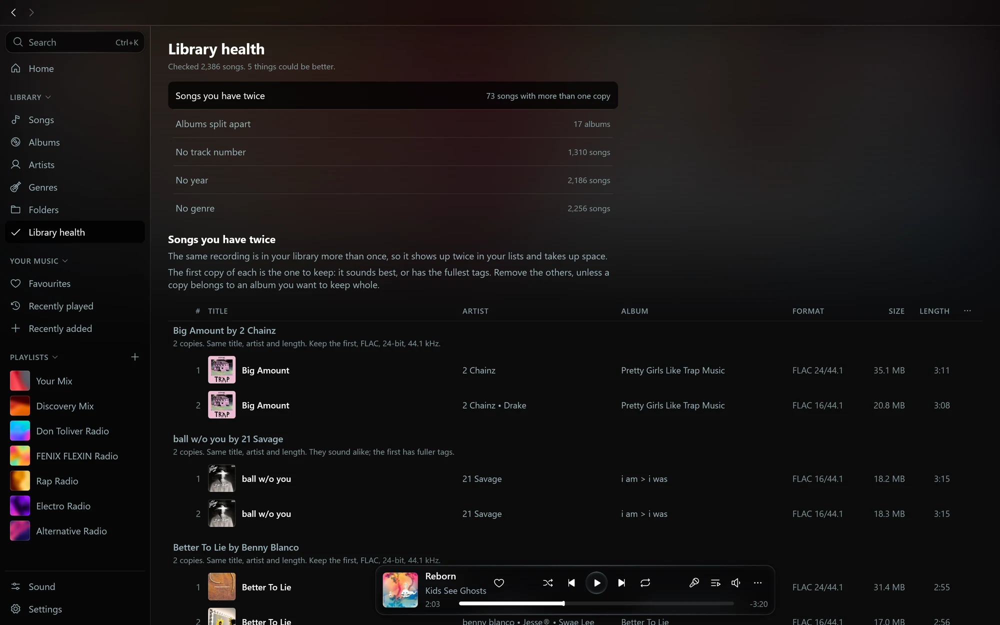<br><sub>Library health</sub></td></tr>
<tr><td width="50%" valign="top"><br><sub>A station with its painted cover</sub></td><td width="50%" valign="top">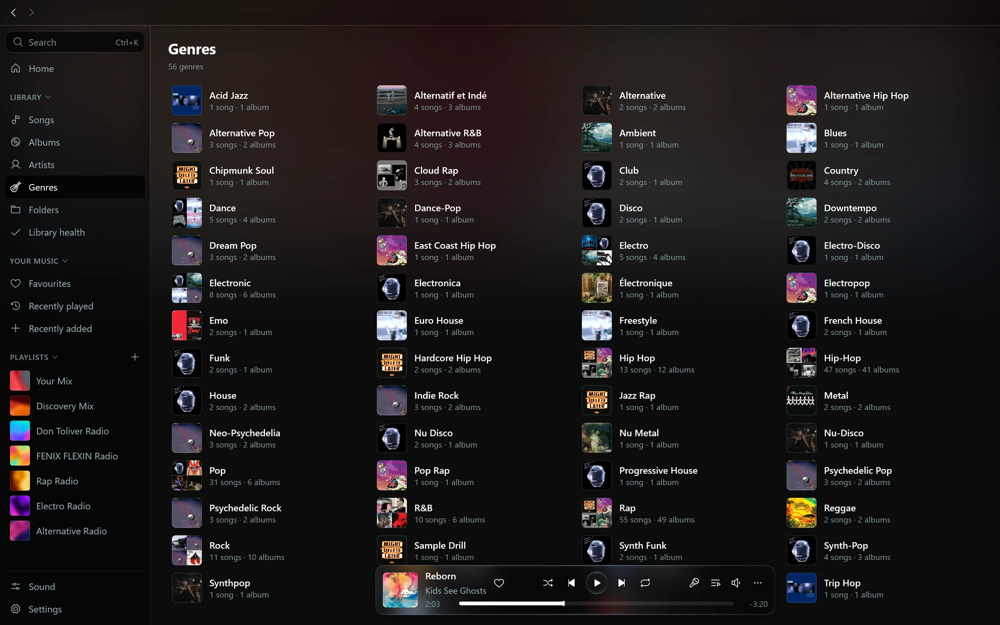<br><sub>Genres</sub></td></tr>
</table>

## The Android app

For Android 10 and newer. Your phone's music and your server's make one library. Download songs, albums and playlists for offline, set streaming quality for Wi-Fi and mobile data, and use the notification, lock screen and widgets.

<table>
<tr><td width="25%" valign="top">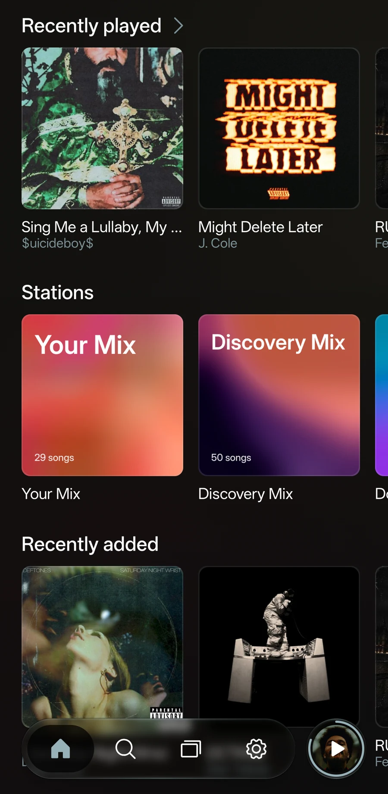<br><sub>Home</sub></td><td width="25%" valign="top"><br><sub>Search</sub></td><td width="25%" valign="top"><br><sub>An album</sub></td><td width="25%" valign="top">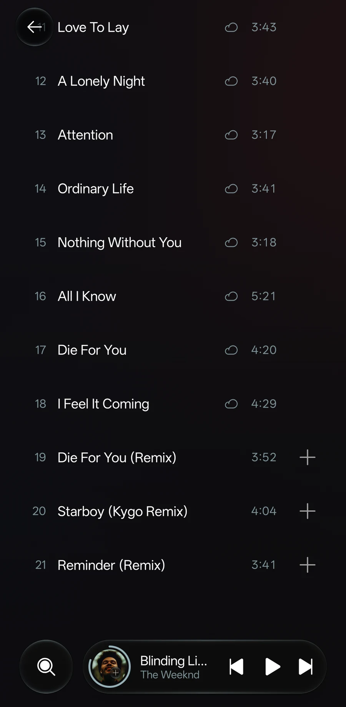<br><sub>Songs you can add</sub></td></tr>
<tr><td width="25%" valign="top">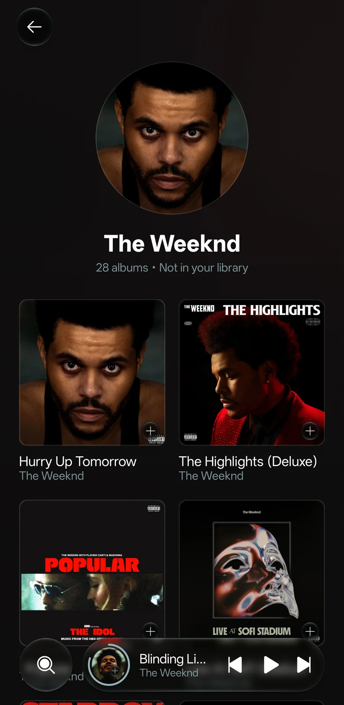<br><sub>An artist found online</sub></td><td width="25%" valign="top"><br><sub>The player</sub></td><td width="25%" valign="top">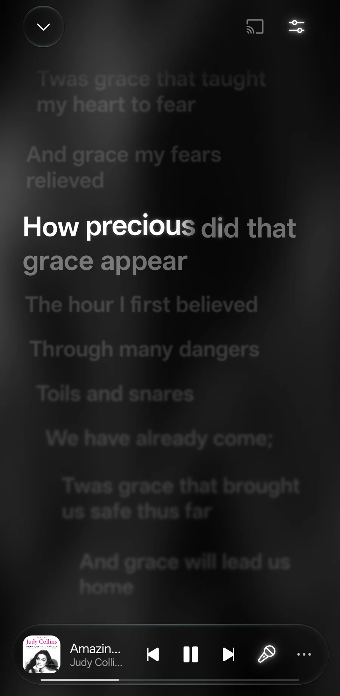<br><sub>Live lyrics</sub></td><td width="25%" valign="top">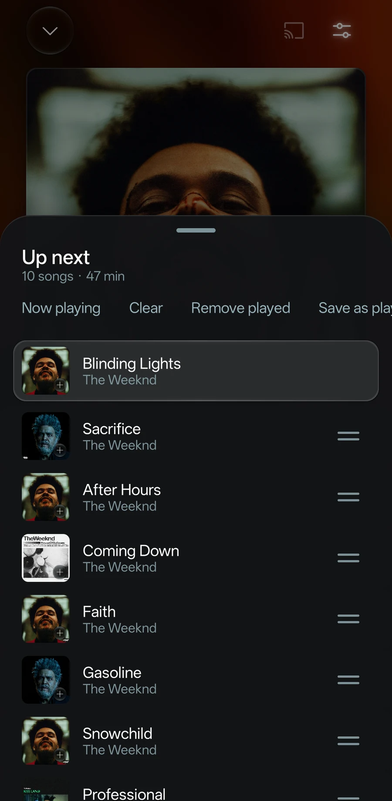<br><sub>Up next</sub></td></tr>
<tr><td width="25%" valign="top">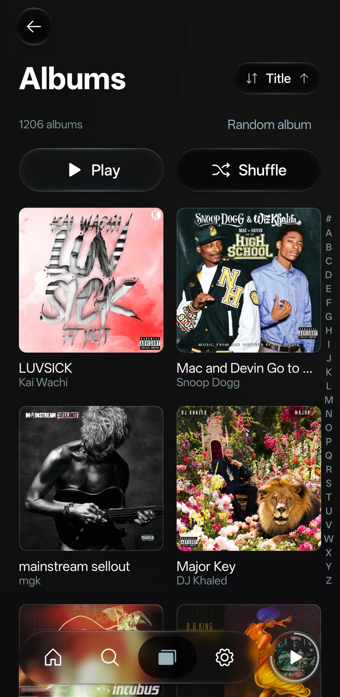<br><sub>Albums</sub></td><td width="25%" valign="top">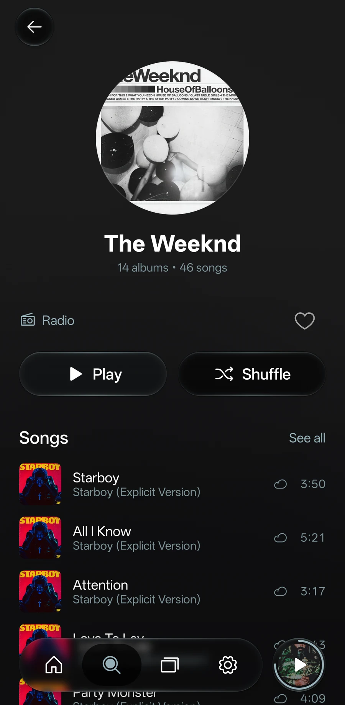<br><sub>An artist in your library</sub></td><td width="25%" valign="top">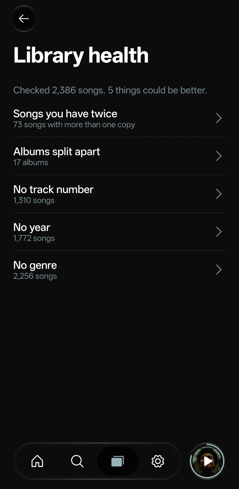<br><sub>Library health</sub></td></tr>
</table>

## Install

Download the latest release:

- [Octo for Windows and Linux](https://github.com/winters27/octo/releases/tag/desktop-v1.3.2): an `.msi` or portable zip for Windows, and a `.deb`, `.rpm` or portable zip for Linux. The Windows installer needs no administrator rights. It isn't code signed yet, so Windows asks the first time you open Octo.
- [Octo for Android](https://github.com/winters27/octo/releases/tag/android-v1.2.4): an `.apk` for Android 10 and newer. Allow your browser or file manager to install apps when Android asks.
- Or add [Octo's F-Droid repository](https://winters27.github.io/octo/fdroid/) in F-Droid, Droid-ify or Neo Store, and the Android app updates there like any other.

New versions appear on the [Octo Releases page](https://github.com/winters27/octo/releases), tagged `desktop-v` and `android-v`.

## Build from source

You need JDK 17. The Android app also needs the Android SDK (platform 37). The desktop app plays through its own audio engine, written in Rust, so it needs Rust 1.88 or newer and:

- Windows: the MSVC build tools.
- Linux: `libasound2-dev` and `pkg-config` (Fedora: `alsa-lib-devel`), plus `fakeroot` and `rpm` to build packages.

```bash
git clone https://github.com/winters27/octo-player.git
cd octo-player

# Android: a debug APK, which installs beside a release build
./gradlew :app:assembleDebug

# Desktop: run it
./gradlew :desktop:run

# Desktop installers, each on its own system
./gradlew :desktop:packageMsi :desktop:packagePortableZip                        # Windows
./gradlew :desktop:packageDeb :desktop:packageRpm :desktop:packagePortableZip    # Linux

# Tests
./gradlew :shared:core:allTests :app:testDebugUnitTest :desktop:test
(cd audio-engine && cargo test)
```

- The debug APK lands in `app/build/outputs/apk/debug/`, and desktop installers in `desktop/build/compose/binaries/main/`.
- `./gradlew :app:assembleRelease` signs the APK when `OCTO_ANDROID_KEYSTORE`, `OCTO_ANDROID_KEYSTORE_PASSWORD`, `OCTO_ANDROID_KEY_ALIAS` and `OCTO_ANDROID_KEY_PASSWORD` are set, and leaves it unsigned otherwise.
- `-Pocto.noSystemShim=true` builds the desktop app without its media-controls helper, which is also written in Rust.

| Folder | What's there |
| --- | --- |
| `app/` | the Android app |
| `desktop/` | the desktop app |
| `shared/core/` | what both apps share: lyrics, sound, queue rules, song matching, covers, updates |
| `subsonic/` | the Subsonic and OpenSubsonic client, with Octo's extensions |
| `design/`, `desktop-design/` | colours, type, icons and fonts |
| `audio-engine/` | the desktop audio engine (Rust) |

## License

[GPL-3.0](LICENSE)

## Credits

- [Inter](https://rsms.me/inter/) by Rasmus Andersson, under the SIL Open Font License 1.1 ([licence](design/licenses/Inter-OFL.txt)).
- [Phosphor Icons](https://phosphoricons.com/), under the MIT License ([licence](design/licenses/Phosphor-MIT.txt)).
